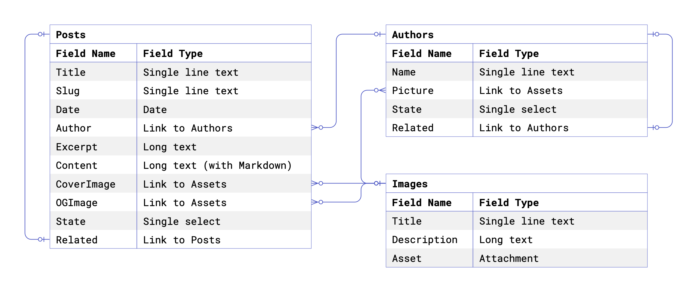
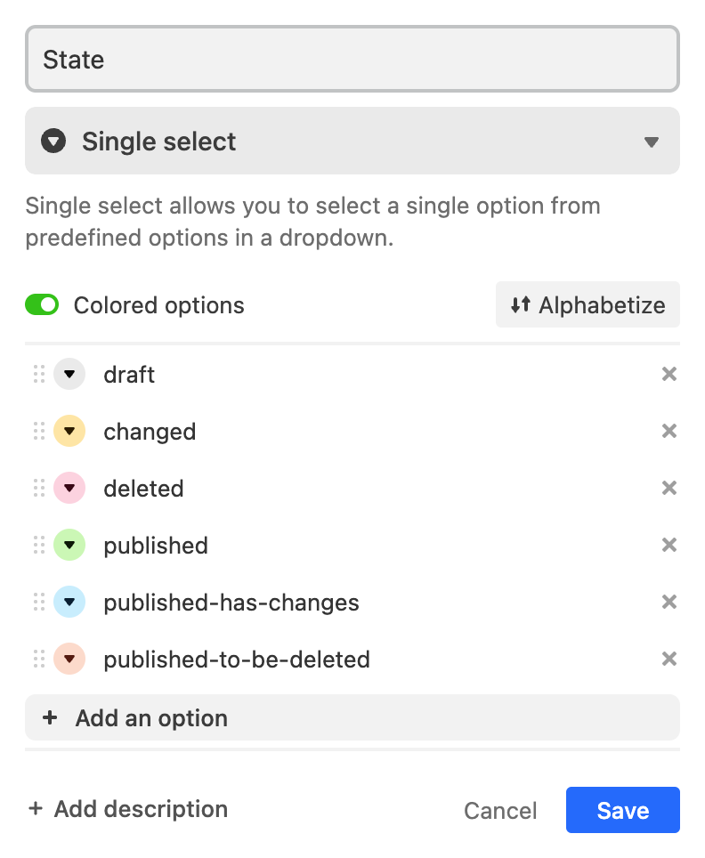
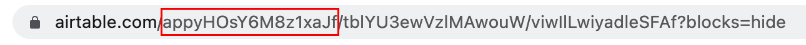
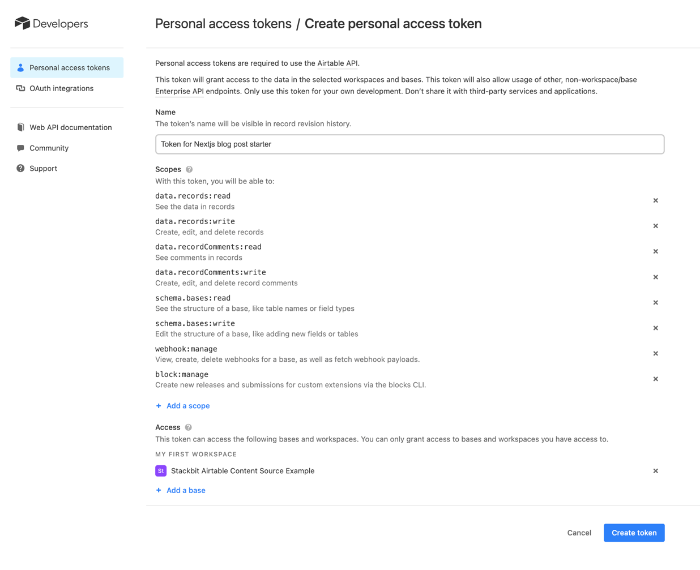

# Custom Content Source Example

This is an example of a custom content source for Stackbit. It uses Airtable as a content storage engine and provides a programmatic interface for Stackbit to manage content states and transitions.

This starter is based on the [Next.js blog starter](https://github.com/vercel/next.js/tree/canary/examples/blog-starter). It replaces the content storage engine from Markdown files to Airtable records. It also adds the Stackbit configuration file [stackbit.config.ts](https://docs.stackbit.com/reference/config) that allows previewing the site inside Stackbit and editing the content stored in Airtable using a visual editing experience.

## Posts and Authors

The blog posts are stored in Airtable in the **Posts** table, and post authors are stored in the **Authors** table. The relation between authors and posts made by the [Linked Record Field](https://support.airtable.com/docs/linked-record-field). This relation is one-to-many, allowing the same author to be referenced from many posts.

## Assets

A [Linked Record Field](https://support.airtable.com/docs/linked-record-field) to the **Assets** table was defined in places where Posts and Authors need to reference an image. Using links to the **Assets** table instead of the [Attachment field](https://support.airtable.com/docs/attachment-field) allows uploading images once and reusing them in multiple places. The records in the **Assets** table have the
[Attachment field](https://support.airtable.com/docs/attachment-field) that stores the actual attachment.

The following diagram provides an overview of the content model in Airtable:



The Airtable's [Long-text with Markdown](https://support.airtable.com/docs/markdown-rich-text-output-in-the-api) field is parsed using [`remark`](https://github.com/remarkjs/remark) and converted into HTML string using [`remark-html`](https://github.com/remarkjs/remark-html).

## `State` and the `Related` fields

Today, modern Content Management Systems have content preview and publish capabilities. Conceptually it means that the content lives in three different states - "draft", "published", and "changed". When the content is created for the first time, it is assigned the "draft" state. The content stays in this state until it is published, at which point, its state is updated from "draft" to "published". When the "published" content is updated, its stage is changed to the "changed" state. Technically, a new copy of the "published" content is created, leaving the original "published" content intact. This ensures that the content can be fetched in its original "published" form at any moment.

For example, assume you have updated a blog post that you aren't ready to publish yet. Then, you found and fixed a bug in your code, and now you want to deploy it. However, you want your site to be built using the content version without your recent changes.

To introduce content publishing capabilities to Airtable and allow Stackbit to leverage them, the **Posts** and the **Authors** tables have been extended with two additional fields - `State` and `Related`. The State field is a [Single select field](https://support.airtable.com/docs/single-select-field) that can have one of the six following states:



- `draft` - a record that has never been published. A "production" site will never show records in this state, but a site running in the "preview" mode will show these records.
- `published` - a record that has been published and has no pending changes. Sites running in both the "production" and the "preview" environments will show `published` records. Records must not be mutated in this state as they represent "production" data.
- `published-has-changes` - a published record that has pending changes. A record in this state contains the data in its last published form. In this state, the `Related` field will reference the record in the `changed` state. Records must not be mutated in this state as they represent "production" data. Any content updates must be applied to the linked record. A "production" site will use the data from this record.
- `changed` - a record containing any pending changes of the published record. In this state, the `Related` field will reference the record in the `published-has-changes` state. Any content updates will be applied to this record. A site running in the "preview" mode will use the data from this record.
- `published-to-be-deleted` - a published record that was marked to be deleted. A "production" site will continue showing the data from this record. However, a site running in "preview" mode will not show this record.
- `deleted` - a deleted record. Both "production" and "preview" sites will not show this record.

The following diagram shows the state machine with these states and transitions between them:


Of course, as an editor using Stackbit, you don't need to think about all the content states and don't need to edit Airtable records directly. The [`AirtableContentSource`](./airtable-content-source/airtable-content-source.ts) and the [`AirtableClient`](./lib/airtable-client.ts) provide a programmatic interface for Stackbit to manage all that for you while you can enjoy a delightful editing experience in Stackbit.

## Preview and Production modes

When running the site in development mode, for example, when running `npm run dev`, the `NODE_ENV` will be set to `development`, and the site will render the content in the `draft`, `published`, and `changed` states. On the other hand, when building your site for production, for example, when running `npm run build`, the `NODE_ENV` will be set to `production`, and the site will use render content in the `published`, `published-has-changes` and `published-to-be-deleted` states.

## Airtable Content Source

The [`stackbit.config.ts`](./stackbit.config.ts) file allows Stackbit to edit and publish the content in Airtable on your behalf. The `stackbit.config.ts` file imports the [`airtable-content-source.ts`](./airtable-content-source/airtable-content-source.ts) that provides a programmatic interface for Stackbit to edit and publish content in Airtable. To learn more about Stackbit and how to configure it, please visit [Stackbit documentation](https://docs.stackbit.com/).

The following diagram provides an overview of how this site works with Stackbit:


## Running Locally

1. Clone this repo and install dependencies (e.g., `npx create-stackbit-app@latest --example airtable-content-source`).
2. Navigate to this Airtable link: https://airtable.com/shrJ396P8lPSm74ha and click "Copy base" on the top of the page (you will need to create an Airtable account).
3. Write down the "Base ID" of your new Airtable Base. The Base ID is the first part between the slashes that comes after the airtable.com and starts with the letters `app`:
   
4. Navigate to your Airtable account page (https://airtable.com/account) and click "Create token" to generate a Personal Access Token. Select all the "Scopes" and select the newly created base in the "Access" section:
   
5. Create a `.env` file with the following environment variables in your cloned repository and paste your Airtable Base ID and Personal Access Token (for security concerns the `.env` file is included in .gitignore and is not committed to git):

   ```
   AIRTABLE_BASE_ID=__REPLACE_WITH_YOUR_BASE_ID__
   AIRTABLE_PERSONAL_ACCESS_TOKEN=__REPLACE_WITH_YOUR_TOKEN__
   ```

6. Install stackbit CLI by running `npm install -g @stackbit/cli`
7. Run `npm run dev` to start the Next.js dev server. Your blog should be up and running on [http://localhost:3000](http://localhost:3000)
8. Open a separate terminal window and run `stackbit dev`. Then click on the link printed in the console (you will need to sign in with Stackbit):

   ```
   info: ⚡ Open https://app.stackbit.com/local/... in your browser
   ```

9. Now you can edit your Airtable powered blog via Stackbit. The [`AirtableContentSource`](./airtable-content-source/airtable-content-source.ts) will update the content in Airtable and move it between the right states as you edit and publish your content.

## Running in Stackbit

After you have run your blog post locally and ensured that everything works as expected, you can import your project into Stackbit. This will allow you to work on your project remotely, share the preview of your blog before publishing it, and let your teammates collaborate with you on your blog.

1. Publish the cloned repo to your personal GitHub repository.
2. Navigate to https://app.stackbit.com/import, select "Use my repository", and click "Next".
3. Connect GitHub if needed, find and select your repository, and click "Next".
4. In the "Configure" step, choose the project name, add the same environment variables you defined in your local `.env` file and click "Create Project".
   

# Notes

`blog-starter` uses [Tailwind CSS](https://tailwindcss.com) [(v3.0)](https://tailwindcss.com/blog/tailwindcss-v3).
