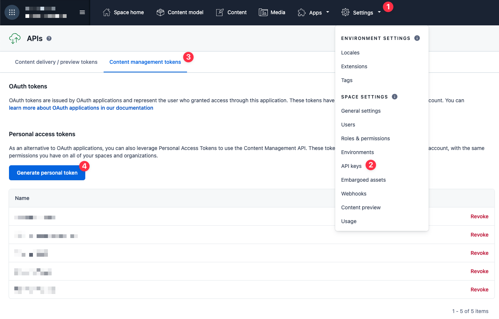

# Multi-Brand (+ i18n) Example with Next.js + Contentful

This example showcases a multi-brand setup based on a single CMS space and a shared codebase.

* Each brand has its own distinct set of pages & related content. **You only see the current brand's content in the visual editor.**
* Each brand has its own color scheme & configuration object.
* **Presets are reusable across brands!** when using a preset from brand A for brand B, the colors of the target brand B apply.
* There is one content type with a single instance (*Multi-Brand Configuration*) that is shared between all brands. It is used to configure common footer text for all brands.
* Each brand has its own localized pages and configuration. Localization features are based on the [i18n example](../i18n-nextjs-contentful/). See the linked example for more details on functionality & implementation. 

## How it works

Firstly, the example Next.js website itself is wired to only read content for the configured brand - see [utils/content.js](./utils/content.js). That code does not depend upon Stackbit in any way. 

All pages, buttons, sections and whatnot have a reference field to a single brand, and that field is used to filter content.

To filter out content in the Stackbit visual editor, check out the `mapDocuments` callback implementation in [stackbit.config.ts](./stackbit.config.ts) ([reference](https://docs.stackbit.com/reference/config/content-modeling#mapdocuments)). Only documents that are returned from this callback are visible in the editor.

Creating content (be it pages or specific components) from presets that were saved in other brands presents a challenge: the content object and all its referenced content all point to the original brand! 

To solve this, note the `OnContentCreate` callback ([reference](https://docs.stackbit.com/reference/config/documents#oncontentcreate)) in the same config file: it is traversing the original content (as stored in the preset) and updating all brand references to the current brand. The visual editor than uses the transformed object to create the new content.

To learn how localization was implemented, [see here](../i18n-nextjs-contentful/README.md).

## Run locally

### Prerequisites

Before you begin, please make sure you have the following:

- Contentful account
- Node v14 or later

### Clone this repository

Clone this repository, then run `npm install` in its root directory.

### Create Contentful Space

After signing into Contentful, create a new space. 

### Generate Management Token

If you don't already have a management token (or _personal access token_), generate one. To do so, go into your new empty space, then:

1. Click _Settings_
1. Choose _API Keys_
1. Select the _Content management tokens_ tab
1. Click the button to generate a new token

### Generate Preview & Delivery API Keys

From the same place you generated the management token, you can now generate API access keys.

1. Select the *content delivery / preview tokens* tab
1. Choose *Add API key*

### Set Environment Variables

In your project, duplicate `.env.example` to `.env`. 

Fill in the values in the file based on the keys you've created. The Contentful space ID can be viewed and copied via *Settings->General Settings* in Contentful.

Note that there are multiple lines for the `CURRENT_BRAND_SLUG` variable, with only a single line enabled. This variable determines the current brand, and is read by both Next.js and Stackbit Local Development Server on startup.

### Import Content

Import the provided content models & content into Contentful by running the `import.js` script:

    node ./contentful/import.js

If the import fails to run, make sure that you've run `npm install` and that all keys in your `.env` file are set correctly.

Looking at the imported content in Contentful, you'll see three objects of type *Brand*. Each of these have a unique value in its `slug` field - which is the fixed identifier used in the `CURRENT_BRAND_SLUG` environment variable in your `.env` file.

### Run the Website

Run the Next.js development server:

    npm run dev

Visit [localhost:3000](http://localhost:3000) and you should see the example content you imported into your new Contentful space.

### Run Stackbit in Local Development Mode

Keep the Next.js development server running, and open a new command-line window in the same directory.

Install Stackbit's CLI tools (once):
    
    npm i -g @stackbit/cli@latest

Run the CLI:

    stackbit dev

Click the displayed link to [localhost:8090/_stackbit](http://localhost:8090/_stackbit) and the visual editor will open.

ℹ️ To switch between brands, change the `CURRENT_BRAND_SLUG` variable value in your `.env` file, and then restart both the Next.js server (`npm run dev` process) and the `stackbit dev` command.

## Creating Multi-Brand Stackbit Projects via the UI

While in local development you can switch between brands by setting the needed env. variable and restaring, when providing cloud-based projects for editors, you'd normally want to have one always-on project for each brand.

All of these projects should share the same Contentful space and code repository, with just the `CURRENT_BRAND_SLUG` value being different.

**Here's how to create such a setup:**

As part of creating the first project, you will create a new Contentful space and repository. These will then be shared with the rest of the projects.

1. Open the `Import` screen in *Duplicate a Repository* mode by [clicking here](https://app.stackbit.com/import?mode=duplicate&repository=https%3A%2F%2Fgithub.com%2Fstackbit-themes%2Fstackbit-examples&rootdir=i18n-multi-brand&validate=auto).
1. Connect your Contentful account to Stackbit.
1. Set the environment variable `CURRENT_BRAND_SLUG` to the first brand's identifier (e.g. *darn-good-sandwiches*).
1. Run the import. A new Contentful space & GitHub repository will be created for you.
1. Transfer ownership of the duplicated repository to your GitHub account, via the Project Settings.

Keep the *Project Settings* dialog open, and switch to the *Advanced* tab. Keep this window open - you will soon need to copy the listed environment variables.

For each of the additional brands:

1. In a new tab, open the `Import` screen in [Use My Repository Mode](https://app.stackbit.com/import?mode=use).
1. Select the repository you've just created above. If you don't see that repository listed, then either you haven't completed transferring the repository to your GitHub account, or you haven't granted Stackbit the permissions to read from the relevant GitHub account/organization.
1. Copy all `CONTENTFUL_...` environment variables from the original project to the new one.
1. Set the `CURRENT_BRAND_SLUG` variable to the relevant brand for this project.
1. Run the import.

When using our paid plans, you can not only assign specific users & teams to each project, but also set **locale-specific permissions**, e.g. limiting some users to only act as single-locale editors within a project.

## Support

Creating & maintaining a multi-brand setup is an advanced functionality. If you get stuck along the way, or are unsure how to proceed, [drop into our Discord server](https://discord.gg/HUNhjVkznH) and send a message in the `#documentation` or `#help` channels.
